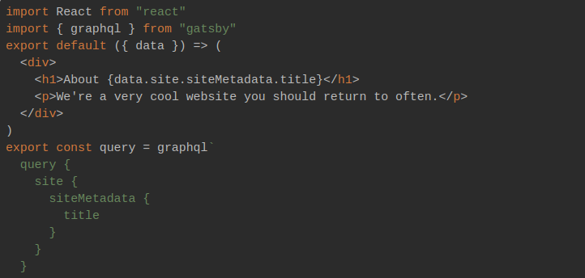

The story begins with my simple willingness to create a blog website. Of course, as any developer who is excited about new technologies, I wanted to use something cool and modern.

My primary technology is Ruby on Rails, but recently I started work on React project, so I thought it would be great to use React or something lighter and here we go, I found Gatsby. After a few minutes of reading the documentation, I realized Gatsby is exactly the right choice to start developing my blog.

## So what is Gatsby and why it is so cool?

As mentioned in documentation Gatsby it's a static site generator for React. In simple words you creating static pages using React. It doesn't use server, Gatsby just generate clean HTML/CSS/JS on build time. That means you can just deploy your blog for example to Github Pages for free.

## GraphQL

One more uniqueness of Gatsby is how you operate data. Gatsby uses **GraphQL** - query language for API's. Using its syntax you describe the data you need to get and then you receive the data in the exact same format you describe them. For example I we want to get title for our site: 

After building site GraphQL is no more using, all data save in JSON files.

## Plugins

Gatby has a huge amount of plugins: from filesystem explorer and image processor to CMS integration such as Contentful, Wordpress and etc.

## Development mode

Gatsby has development mode which can speed up your ability to make live edits without page reloads using features like hot module replacement. It makes the development process extra fast and elegant.

## Conclusion

In this post, I made only a high-level overview of Gatsby and its main features. I think Gatsby is a great tool if you want to create small websites or blogs. Its ecosystem is ideal for connecting CMS and its tools will make your development easier and more comfortable.

Happy coding :)