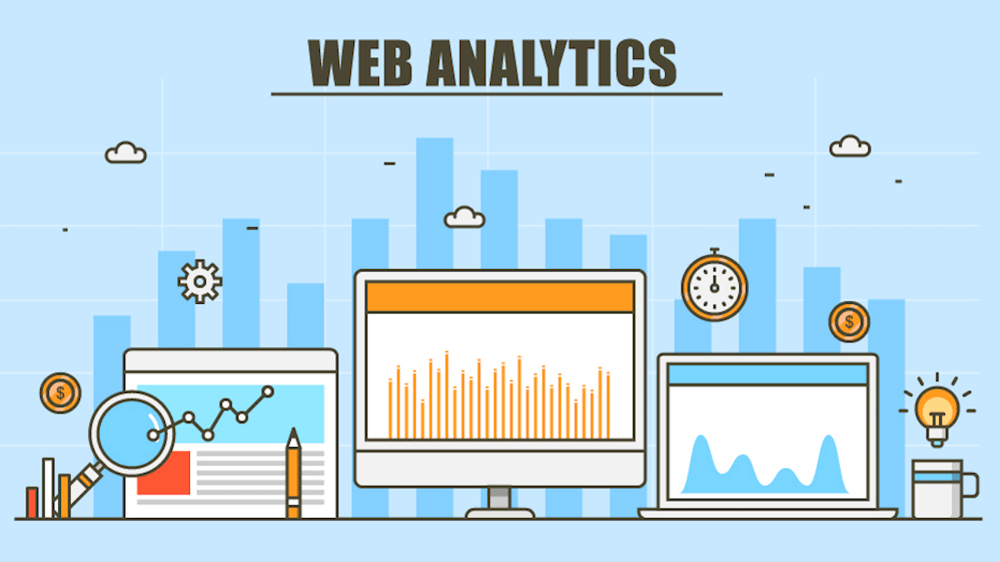

## What Is Web Analytics
Web analytics is the measurement and analysis of data to inform an understanding of user behavior across web pages.

Analytics platforms measure activity and behavior on a website, for example: how many users visit, how long they stay, how many pages they visit, which pages they visit, and whether they arrive by following a link or not.

Businesses use web analytics platforms to measure and benchmark site performance and to look at key performance indicators that drive their business, such as purchase conversion rate.

##

## Why Web Analytics Are Important
There’s an old business adage that whatever is worth doing is worth measuring.

Website analytics provide insights and data that can be used to create a better user experience for website visitors.

Understanding customer behavior is also key to optimizing a website for key conversion metrics.

For example, web analytics will show you the most popular pages on your website, and the most popular paths to purchase.

With website analytics, you can also accurately track the effectiveness of your online marketing campaigns to help inform future efforts.

## How Web Analytics Work
Most analytics tools ‘tag’ their web pages by inserting a snippet of JavaScript in the web page’s code.

Using this tag, the analytics tool counts each time the page gets a visitor or a click on a link. The tag can also gather other information like device, browser and geographic location (via IP address).

Web analytics services may also use cookies to track individual sessions and to determine repeat visits from the same browser.

Since some users delete cookies, and browsers have various restrictions around code snippets, no analytics platform can claim full accuracy of their data and different tools sometimes produce slightly different results.

## Sample Web Analytics Data
Web analytics data is typically presented in dashboards that can be customized by user persona, date range, and other attributes. Data is broken down into categories, such as:

##
#### Audience Data

* number of visits, number of unique visitors
* new vs. returning visitor ratio
* what country they are from
* what browser or device they are on (desktop vs. mobile)

##
#### Audience Behavior

* common landing pages
* common exit page
* frequently visited pages
* length of time spent per visit
* number of pages per visit
* bounce rate

##
## The following are some of the most commonly used tools:

* Google Analytics - the ‘standard’ website analytics tool, free and widely used
* Piwik - an open-source solution similar in functionality to Google and a popular alternative, allowing companies full ownership and control of their data
* Adobe Analytics - highly customizable analytics platform (Adobe bought analytics leader Omniture in 2009)
* Kissmetrics - can zero in on individual behavior, i.e. cohort analysis, conversion and retention at the segment or individual level
* Mixpanel - advanced mobile and web analytics that measure actions rather than pageviews
* Parse.ly - offers detailed real-time analytics, specifically for publishers
* CrazyEgg - measures which parts of the page are getting the most attention using ‘heat mapping’
* Clicktale - uses ‘heat mapping,’ keystrokes and mouse movement

#
With a wide variety of analytics tools on the market, the right vendors for your company’s needs will depend on your specific requirements. Luckily, Optimizely integrates with most of the leading platforms to simplify your data analysis.